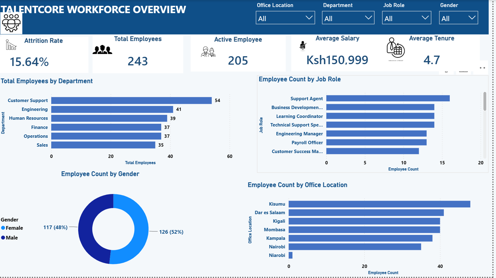
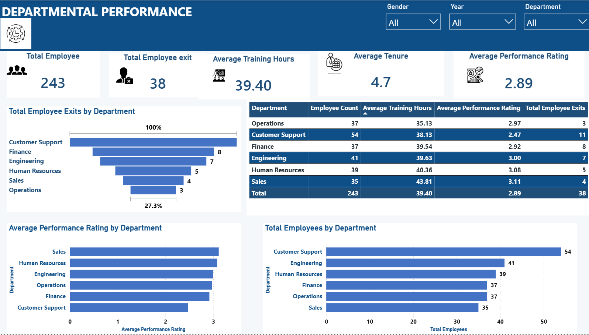
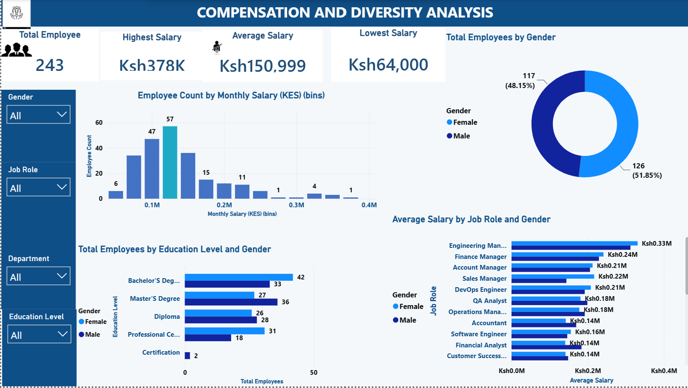

Human Resource Analytics | Power BI

 📊 Project Overview
An interactive HR Analytics Dashboard built with Power BI to analyze workforce data and provide insights into employee attrition, departmental performance, compensation, and diversity.

🎯 Objectives
- Analyze workforce composition and demographics.
- Identify departments and roles with higher attrition.
- Analyze employee performance.
- Examine salary and compensation patterns.
- Provide data-driven HR recommendations.

 🛠️ Tools Used
- Power BI
- Power Query
- DAX
- Microsoft Excel

Data Preparation
The data was cleaned and transformed by handling missing values, correcting inconsistent entries, standardizing categories, and preparing fields for analysis.

 📈 Dashboard Analysis
The dashboard covers:
- Workforce Overview
- Attrition Analysis
- Departmental Performance
- Compensation & Diversity

💡 Key Insights
The analysis highlights differences in employee attrition, workforce composition, departmental performance, and compensation across the organization.

👩‍💻 Skills Demonstrated
Data Cleaning | Data Analysis | Power BI | Power Query | DAX | Data Visualization | Dashboard Design | HR Analytics

## 📊 Dashboard Preview

### Workforce Overview

### Attrition Analysis
![Attrition_Analysis]
https://github.com/WaweruGrace/Human-Resource-Analytics/blob/main/Attrition_%20Analysis.png?raw=true

### Departmental Performance

### Compensation & Diversity

